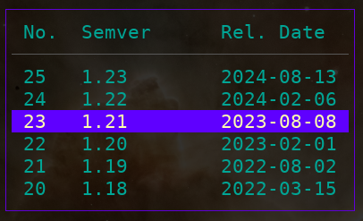

# gosemver

Prints or opens respective URLs for user provided Go semvers or dates.
In case of dates the program finds the respective Go semver.

## demo

The command `gosemver -open -print -date 2015-01-01` prints the help URL for the
Go version current at that date and opens it in browser, which is 
`https://go.dev/doc/devel/release#go1.4`.

There is also and interactive flag `gosemver -open -print -interactive` which
opens a CLI menu to choose the version and release date from.

  

## tasks

  - [ ] forgive semantic versions of the form `v1.0.0`.
  - [ ] do not allow dates before first Go release, i.e. before 2011-01-01.
  - [ ] use Go's [cobra package](https://github.com/spf13/cobra/issues/1216) for mutually exclusive CLI arguments.

## ideas

  - [X] take the data from https://go.dev/doc/devel/release and make it accessible
  - [X] via package
  - [X] via CLI

## info

  - https://github.com/charmbracelet/bubbletea/blob/main/examples/table/main.go
